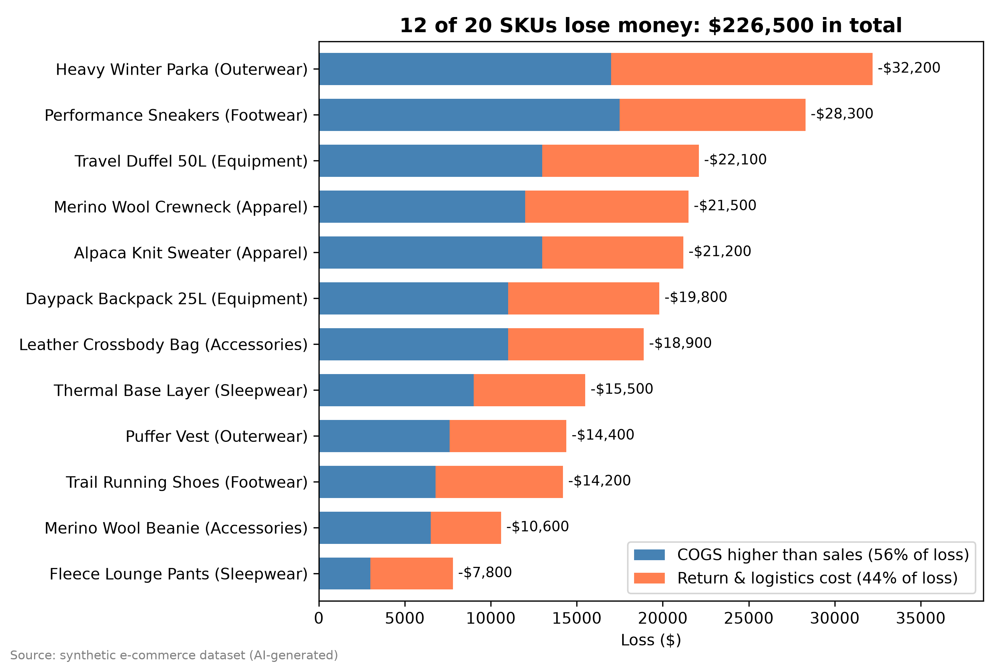

# E-commerce Negative Margin Analysis

**Business problem:** The company has a negative margin in e-commerce. Stakeholders want to know how many SKUs have a negative margin, how much loss they make, and why.

**Data:** AI-generated dataset of 20 SKUs (sales, COGS, return & logistics cost)

**Tools:** SQL (DuckDB), pandas, matplotlib

## Insight

- 12 of 20 SKUs (60%) have a negative margin. Total loss is $226,500.
- Because of this, the whole business is at -$21,400 on $2.69M sales.
- All 12 SKUs have COGS higher than the sales price, so they lose money even before returns.
- 56% of the loss is from the price gap and 44% is from returns and logistics.

## Recommendation

1. Increase the price or negotiate lower COGS. Start with the top 3 SKUs (36% of the loss).
2. Reduce return costs for items with high returns, like Heavy Winter Parka.
3. Stop selling SKUs that can't reach break-even.

Full analysis: [analysis.ipynb](analysis.ipynb)
